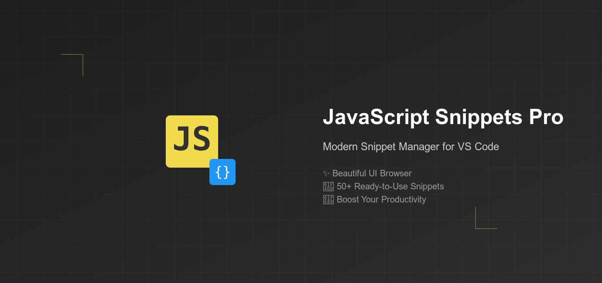

# JavaScript Snippets Pro 🚀

> Modern JavaScript snippet manager with a beautiful UI and seamless VS Code integration.



## Features ✨

- **Beautiful Snippet Browser**: Modern, searchable UI to browse and manage your snippets
- **50+ Ready-to-Use Snippets**: Carefully crafted for modern JavaScript development
- **Customizable**: Add, edit, or remove snippets to match your coding style
- **Quick Access**: Use Command Palette or dedicated Snippet Browser
- **ES6+ Support**: Covers latest JavaScript features and best practices
- **Smart Search**: Find snippets by name, description, or content


## Quick Start 🏃‍♂️

1. Open Command Palette (`Ctrl+Shift+P` / `Cmd+Shift+P`)
2. Type "Show JavaScript Snippets"
3. Choose between:
   - **Quick Pick**: Fast snippet insertion
   - **Browser**: Full snippet management

## Available Snippets 📝

Here are some included snippets to get you started:

```javascript
// Console logging (log)
console.log('message');

// Arrow function (af)
const name = (params) => {
    
}

// Async function (afn)
async function name(params) {
    
}

// And 45+ more...
```

## Managing Snippets 🛠️

### Adding New Snippets:
1. Open Snippet Browser
2. Click "Add New Snippet"
3. Fill in prefix, description, and code
4. Save!

### Editing Snippets:
1. Find snippet in browser
2. Click "Edit"
3. Modify and save

## Key Bindings ⌨️

- Open Quick Pick: `Ctrl+Shift+P` → "Show JavaScript Snippets"
- Open Snippet Browser: `Ctrl+Shift+P` → "Show JavaScript Snippets (Browser)"

## Why JavaScript Snippets Pro? 💡

- **Beautiful Interface**: Not just another snippet extension - includes a modern, searchable UI
- **Productivity Focus**: Carefully selected snippets that you'll actually use
- **Customizable**: Make it yours by adding your commonly used code patterns
- **Active Development**: Regular updates and new features
- **Performance**: Light-weight and fast, won't slow down your editor

## Contributing 🤝

Found a bug or have a feature request? [Open an issue](https://github.com/Shellomo/vscode_ext_javascript-snippets-pro/issues)!

Want to contribute? [Fork the repository](https://github.com/Shellomo/vscode_ext_javascript-snippets-pro) and submit a pull request.

## Release Notes 📋

### 0.0.1
- Initial release
- 50+ JavaScript snippets
- Snippet Browser UI
- Search functionality
- Custom snippet management

## Support 💪

Like this extension? [Rate it on the marketplace](https://marketplace.visualstudio.com/items?itemName=Shellomo.js-snippets-pro)!

---

**Enjoy coding faster with JavaScript Snippets Pro! ⚡**